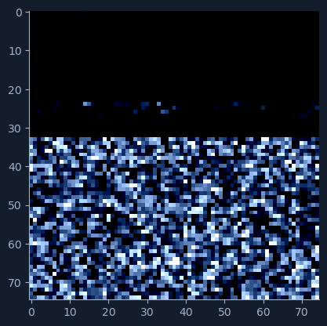
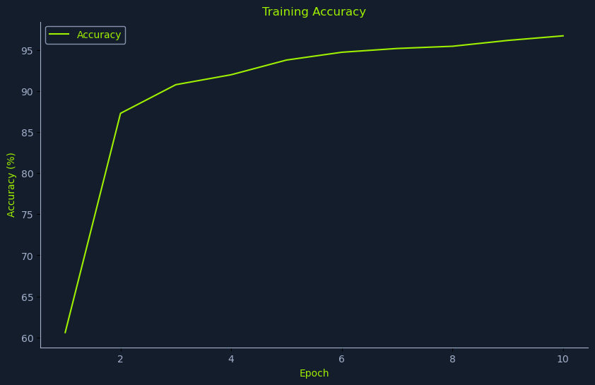
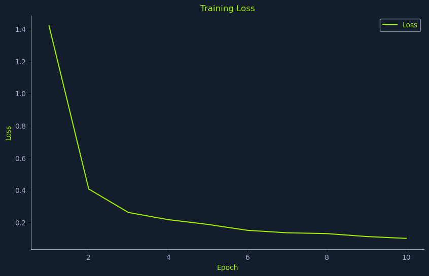

# Malware Classification - Walkthrough

A step-by-step guide covering the theory and implementation behind this malware image classification project. If you're here to learn, this is for you.

## Table of Contents

- [1. Theory: Malware Visualization & CNNs](#1-theory-malware-visualization--cnns)
- [2. Getting and Exploring the Dataset](#2-getting-and-exploring-the-dataset)
- [3. Preprocessing and Splitting](#3-preprocessing-and-splitting)
- [4. Normalization and DataLoaders](#4-normalization-and-dataloaders)
- [5. The Model: Transfer Learning with ResNet50](#5-the-model-transfer-learning-with-resnet50)
- [6. Training](#6-training)
- [7. Evaluation and Inference](#7-evaluation-and-inference)
- [8. Saving the Model](#8-saving-the-model)

---

## 1. Theory: Malware Visualization & CNNs

This project classifies malware *families* from images, instead of directly handling executable binaries. The approach is based on this paper: [Malware Classification with Deep Learning](https://arxiv.org/pdf/2010.16108).

### Key Idea

A PE (Portable Executable) binary is a sequence of bytes. You can:

- Read bytes as integers 0-255
- Arrange them into a 2D array
- Treat that as a grayscale image

Samples from the same family tend to have similar **byte-level structure**, which shows up as similar **texture/patterns** in the image. CNNs are very good at picking up local patterns and textures in images, so they can learn to distinguish families from these patterns.

### How Binary-to-Image Conversion Works

The conversion process is straightforward:

1. Read the malware binary as raw bytes
2. Map each byte (0-255) into an 8-bit vector
3. Arrange bytes into a 2D grid
4. Render as a grayscale image

Each binary byte is fully encoded within the image, meaning the image can be used to exactly reconstruct the binary without any loss of information. As long as you:

- Treat the file as raw bytes
- Map each byte directly to one pixel
- Avoid lossy operations (resizing, compression, color changes)

...then you can take any malware, convert it to an image, and convert it right back without losing information.

> **Note:** In our training pipeline we *do* resize images to 75x75 for the CNN, which means the model works on a lossy representation. The lossless property applies to the original visualization, not the training input.

---

## 2. Getting and Exploring the Dataset

### Downloading and Unpacking

We use the `malimg` dataset, which contains 9,339 image files across 25 different malware families. Each image is a visual representation of a PE file (a Windows executable).

```bash
wget https://www.kaggle.com/api/v1/datasets/download/ikrambenabd/malimg-original -O malimg.zip
unzip malimg.zip
```

### Exploring the Dataset

Set up the base path and count the number of samples per malware family:

```python
import os
import matplotlib.pyplot as plt
import seaborn as sns

DATA_BASE_PATH = "./malimg_paper_dataset_imgs/"

# Compute the class distribution
dist = {}
for mlw_class in os.listdir(DATA_BASE_PATH):
    mlw_dir = os.path.join(DATA_BASE_PATH, mlw_class)  # Constructs the full path
    dist[mlw_class] = len(os.listdir(mlw_dir))
```

### Visualizing Class Distribution

```python
# data
classes = list(dist.keys())
frequencies = list(dist.values())

# plot
plt.figure(facecolor=node_black)
sns.barplot(y=classes, x=frequencies, edgecolor="black", orient='h', color=htb_green)
plt.title("Malware Class Distribution", color=htb_green)
plt.xlabel("Malware Class Frequency", color=htb_green)
plt.ylabel("Malware Class", color=htb_green)
plt.show()
```

Since some malware families appear far more than others, this class imbalance could skew the model and produce inaccurate predictions. Ideally, you would fine-tune the dataset before training to ensure a more balanced class distribution.

---

## 3. Preprocessing and Splitting

### Splitting with split-folders

We use the `split-folders` library to split the data into training and test sets:

```bash
pip3 install split-folders
```

```python
import splitfolders

DATA_BASE_PATH = "./malimg_paper_dataset_imgs/"
TARGET_BASE_PATH = "./newdata/"

TRAINING_RATIO = 0.8
TEST_RATIO = 1 - TRAINING_RATIO

splitfolders.ratio(input=DATA_BASE_PATH, output=TARGET_BASE_PATH, ratio=(TRAINING_RATIO, 0, TEST_RATIO))
```

This creates a `newdata/` directory with `train/` and `test/` subdirectories, each containing the same 25 family subfolders with an 80/20 split.

### Installing PyTorch

We don't want the whole CUDA 12 stack, so we install the official CPU wheel index which has no CUDA (saves a ton of space):

```bash
pip3 install --index-url https://download.pytorch.org/whl/cpu torch==2.2.2 torchvision==0.17.2
```

---

## 4. Normalization and DataLoaders

### Why Normalize?

Normalization ensures that the images are standardized. Essentially: take an image, turn it into a tensor, so the neural network can understand and train on it.

Here we:

1. Resize the image to 75x75 pixels
2. Convert the image into a PyTorch Tensor
3. Perform normalization (standardizing pixel values)

```python
from torchvision import transforms

transform = transforms.Compose([
    transforms.Resize((75, 75)),
    transforms.ToTensor(),
    transforms.Normalize(mean=[0.485, 0.456, 0.406], std=[0.229, 0.224, 0.225])
])
```

### Applying the Transform to All Images

These lines create PyTorch dataset objects that know how to find your malware images on disk, apply your transform, and return `(image_tensor, label)` pairs when you index them or use them with a DataLoader:

```python
from torchvision.datasets import ImageFolder
import os

BASE_PATH = "./newdata/"

train_dataset = ImageFolder(
    root=os.path.join(BASE_PATH, "train"),
    transform=transform
)

test_dataset = ImageFolder(
    root=os.path.join(BASE_PATH, "test"),
    transform=transform
)
```

### Creating DataLoaders

`DataLoader` is a PyTorch helper that takes a dataset and turns it into an easy-to-use **iterator over batches** of data, instead of you manually loading files one by one.

```python
from torch.utils.data import DataLoader

train_loader = DataLoader(
    train_dataset,
    batch_size=TRAIN_BATCH_SIZE,
    shuffle=True,
    num_workers=2
)

test_loader = DataLoader(
    test_dataset,
    batch_size=TEST_BATCH_SIZE,
    shuffle=False,
    num_workers=2
)
```

What the DataLoader handles for you:

1. **Batching**: Instead of processing 1 image at a time, you process, say, 1024 images at once (`batch_size=1024`). This is much faster and matches how neural nets are implemented.
2. **Shuffling (for training)**: `shuffle=True` for `train_loader` randomizes the order each epoch so the model doesn't overfit to a fixed order.
3. **Parallel loading**: `num_workers=2` means 2 background processes load and preprocess images while your model trains on the current batch, reducing waiting time.
4. **Clean training loop**: Your training code can just do `for batch in train_loader:` and not worry about file paths, transforms, or batching logic.

> So in this malware project, `DataLoader` is the component that efficiently feeds preprocessed malware image tensors + labels into the CNN during both training (`train_loader`) and testing (`test_loader`).

### Checking the Normalized Image

You can visualize a normalized sample from the DataLoader:

```python
sample = next(iter(train_loader))[0][0]
plt.imshow(sample.permute(1, 2, 0))
plt.show()
```



### Combining Everything into a Single Function

```python
from torchvision import transforms
from torch.utils.data import DataLoader
from torchvision.datasets import ImageFolder
import os

def load_datasets(base_path, train_batch_size, test_batch_size):
    transform = transforms.Compose([
        transforms.Resize((75, 75)),
        transforms.ToTensor(),
        transforms.Normalize(mean=[0.485, 0.456, 0.406], std=[0.229, 0.224, 0.225])
    ])

    train_dataset = ImageFolder(
        root=os.path.join(base_path, "train"),
        transform=transform
    )

    test_dataset = ImageFolder(
        root=os.path.join(base_path, "test"),
        transform=transform
    )

    train_loader = DataLoader(
        train_dataset,
        batch_size=train_batch_size,
        shuffle=True,
        num_workers=2
    )

    test_loader = DataLoader(
        test_dataset,
        batch_size=test_batch_size,
        shuffle=False,
        num_workers=2
    )

    n_classes = len(train_dataset.classes)
    return train_loader, test_loader, n_classes
```

---

## 5. The Model: Transfer Learning with ResNet50

We use the ResNet family of CNNs for this, specifically a pretrained `ResNet50` model. The code downloads the pretrained model, runs it on our malware image dataset, and fine-tunes it for our purpose.

> To speed up training, we freeze all layers of ResNet except the final one.

### Class Definition and Loading ResNet50

```python
import torch.nn as nn
import torchvision.models as models

HIDDEN_LAYER_SIZE = 1000

class MalwareClassifier(nn.Module):
    def __init__(self, n_classes):
        super(MalwareClassifier, self).__init__()
        # Load pretrained ResNet50
        self.resnet = models.resnet50(weights='DEFAULT')
```

- `MalwareClassifier` is a PyTorch model class.
- `__init__(self, n_classes)` runs once when you create it, e.g. `MalwareClassifier(25)`.
- `models.resnet50(weights='DEFAULT')` loads a ResNet50 that was pretrained on ImageNet (a huge image dataset).

We start with a model that already knows a lot about general image patterns.

### Freezing All ResNet Layers

```python
        for param in self.resnet.parameters():
            param.requires_grad = False
```

A model has parameters (weights). If `requires_grad=False`, PyTorch **does not update** that parameter during training. This loop sets all ResNet weights to "frozen".

Result:
- During training, gradients are not computed for those layers
- The optimizer will not change them
- This makes training faster and needs less data (you're only training the new last layer, not all 23M parameters)

### Replacing the Last Fully Connected Layer

```python
        num_features = self.resnet.fc.in_features
        self.resnet.fc = nn.Sequential(
            nn.Linear(num_features, HIDDEN_LAYER_SIZE),
            nn.ReLU(),
            nn.Linear(HIDDEN_LAYER_SIZE, n_classes)
        )
```

The `self.resnet.fc` is the final classification layer. We:
- Find out how many features come into that last layer (2048 for ResNet50)
- Replace it with a new head: `2048 -> 1000 -> 25`
- These new layers are trained from scratch on our malware dataset

### Forward Pass

```python
    def forward(self, x):
        return self.resnet(x)
```

When you call `model(images)`, PyTorch runs this `forward` function. It passes the input `x` (your batch of images) through the whole `self.resnet`:

1. Frozen convolution layers extract features
2. New final `fc` head turns those features into `n_classes` logits

### Initializing the Model

```python
train_loader, test_loader, n_classes = load_datasets(DATA_PATH, TRAINING_BATCH_SIZE, TEST_BATCH_SIZE)
model = MalwareClassifier(n_classes)
```

---

## 6. Training

An epoch in machine learning signifies one complete pass of the entire training dataset through a model, allowing it to update internal weights and learn patterns.

### Setup: Loss, Optimizer and Bookkeeping

```python
def train(model, train_loader, n_epochs, verbose=False):
    model.train()
    criterion = torch.nn.CrossEntropyLoss()
    optimizer = torch.optim.Adam(model.parameters())

    training_data = {"accuracy": [], "loss": []}
```

- `model.train()` puts the model in training mode (enables things like dropout, batchnorm updates)
- `criterion = torch.nn.CrossEntropyLoss()` is the loss function for multi-class classification. It compares model outputs (`[batch, n_classes]`) with true labels (`[batch]`) and gives a single loss value
- `optimizer = torch.optim.Adam(model.parameters())` -- Adam optimizer will tweak the model's trainable parameters to minimize the loss
- `training_data` stores accuracy and loss per epoch for plotting later

### Outer Loop: Repeat for Each Epoch

```python
    for epoch in range(n_epochs):
        running_loss = 0
        n_total = 0
        n_correct = 0
        checkpoint = time.time() * 1000
```

Per epoch, it initializes:

- `running_loss = 0`: sum of losses over all batches in this epoch
- `n_total = 0`: total number of samples seen in this epoch
- `n_correct = 0`: how many predictions were correct
- `checkpoint`: timestamp, used later to measure how long the epoch took (in ms)

### Inner Loop: Go Over All Batches

```python
        for inputs, labels in train_loader:
            optimizer.zero_grad()
            outputs = model(inputs)
            loss = criterion(outputs, labels)
            loss.backward()
            optimizer.step()
```

This is the **core training step** for each batch:

- `for inputs, labels in train_loader:` -- each iteration gives you:
  - `inputs`: batch of images, shape `[batch_size, 3, 75, 75]`
  - `labels`: batch of class indices, shape `[batch_size]`
- `optimizer.zero_grad()` clears old gradients from the previous batch so they don't accumulate
- `outputs = model(inputs)` -- forward pass: run the model on the batch. `outputs` has shape `[batch_size, n_classes]` (logits for each class)
- `loss = criterion(outputs, labels)` computes classification loss for that batch: "how wrong were we?"
- `loss.backward()` -- backprop: compute gradients of the loss w.r.t. all trainable parameters
- `optimizer.step()` uses those gradients to update the model weights a tiny bit

### Measuring Accuracy and Accumulating Stats

```python
            _, predicted = outputs.max(1)
            n_total += labels.size(0)
            n_correct += predicted.eq(labels).sum().item()
            running_loss += loss.item()
```

- `outputs.max(1)` takes the index of the largest logit per sample along dimension 1, giving the predicted class
- `n_total += labels.size(0)` adds how many samples were in this batch
- `predicted.eq(labels)` creates a boolean tensor: `True` if correct, `False` if not. `.sum()` counts correct predictions
- `running_loss += loss.item()` adds this batch's loss to the epoch loss sum

After the inner loop, `n_correct / n_total` is accuracy over the entire epoch, and `running_loss / len(train_loader)` is average loss per batch.

### End of Epoch: Compute Averages, Log and Print

```python
        epoch_loss = running_loss / len(train_loader)
        epoch_duration = int(time.time() * 1000 - checkpoint)
        epoch_accuracy = compute_accuracy(n_correct, n_total)

        training_data["accuracy"].append(epoch_accuracy)
        training_data["loss"].append(epoch_loss)

        if verbose:
            print(f"[i] Epoch {epoch+1} of {n_epochs}: Acc: {epoch_accuracy:.2f}% "
                  f"Loss: {epoch_loss:.4f} (Took {epoch_duration} ms).")

    return training_data
```

### Training Results

```
[i] Epoch 1 of 10: Acc: 60.60% Loss: 1.4193 (Took 28579 ms).
[i] Epoch 2 of 10: Acc: 87.30% Loss: 0.4063 (Took 25845 ms).
[i] Epoch 3 of 10: Acc: 90.79% Loss: 0.2605 (Took 26132 ms).
[i] Epoch 4 of 10: Acc: 92.00% Loss: 0.2161 (Took 26910 ms).
[i] Epoch 5 of 10: Acc: 93.79% Loss: 0.1864 (Took 26168 ms).
[i] Epoch 6 of 10: Acc: 94.74% Loss: 0.1497 (Took 26220 ms).
[i] Epoch 7 of 10: Acc: 95.20% Loss: 0.1344 (Took 25920 ms).
[i] Epoch 8 of 10: Acc: 95.47% Loss: 0.1294 (Took 25816 ms).
[i] Epoch 9 of 10: Acc: 96.18% Loss: 0.1112 (Took 25490 ms).
[i] Epoch 10 of 10: Acc: 96.74% Loss: 0.0997 (Took 25784 ms).
[i] Inference accuracy: 88.83%.
```





> From the graphs, we can see that as the epochs go up, the training loss gets minimized and the training accuracy increases. This shows that the model learns how to classify better.

---

## 7. Evaluation and Inference

### Predict Function

Runs the model on a single input and returns the predicted classes:

```python
def predict(model, test_data):
    model.eval()

    with torch.no_grad():
        output = model(test_data)
        _, predicted = torch.max(output.data, 1)

    return predicted
```

- `model.eval()` puts the model into evaluation mode
- `torch.no_grad()` disables gradient computation since we're not training
- `torch.max(output.data, 1)` picks the class with the highest logit for each sample

### Evaluate Function

Loops through the entire test dataset and evaluates the model's performance:

```python
def compute_accuracy(n_correct, n_total):
    return round(100 * n_correct / n_total, 2)

def evaluate(model, test_loader):
    model.eval()

    n_correct = 0
    n_total = 0

    with torch.no_grad():
        for data, target in test_loader:
            predicted = predict(model, data)
            n_total += target.size(0)
            n_correct += (predicted == target).sum().item()

    accuracy = compute_accuracy(n_correct, n_total)

    return accuracy
```

Line by line:

- `model.eval()` puts the model into evaluation mode
- `with torch.no_grad():` disables gradients during evaluation
- `for data, target in test_loader:` loops over the entire test set in batches
  - `data`: batch of test images (`[batch_size, 3, 75, 75]`)
  - `target`: true labels for those images (`[batch_size]`)
- `predicted = predict(model, data)` gets the predicted class indices for this batch
- `(predicted == target).sum().item()` counts how many predictions were correct in this batch

After the loop: `n_total` = total test images, `n_correct` = correctly classified. Final test accuracy: **88.83%**.

---

## 8. Saving the Model

```python
def save_model(model, path):
    model_scripted = torch.jit.script(model)
    model_scripted.save(path)
```

`torch.jit.script` converts the model into TorchScript, a serializable and optimizable format. The saved `.pth` file contains the full model architecture and weights, and can be loaded later without needing the original class definition.

### The Full Training Script

Putting it all together:

```python
# data parameters
DATA_PATH = "./newdata/"

# training parameters
N_EPOCHS = 10
TRAINING_BATCH_SIZE = 512
TEST_BATCH_SIZE = 1024

# model parameters
HIDDEN_LAYER_SIZE = 1000
MODEL_FILE = "malware_classifier.pth"

# Load datasets
train_loader, test_loader, n_classes = load_datasets(DATA_PATH, TRAINING_BATCH_SIZE, TEST_BATCH_SIZE)

# Initialize model
model = MalwareClassifier(n_classes)

# Train model
print("[i] Starting Training...")
training_information = train(model, train_loader, N_EPOCHS, verbose=True)

# Save model
save_model(model, MODEL_FILE)

# Evaluate model
accuracy = evaluate(model, test_loader)
print(f"[i] Inference accuracy: {accuracy}%.")

# Plot training details
plot_training_accuracy(training_information)
plot_training_loss(training_information)
```
