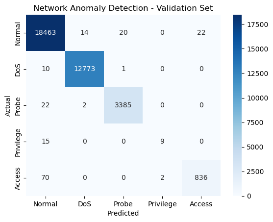

# Network Anomaly Detection - Walkthrough

A step-by-step guide covering the theory and implementation behind this network intrusion detection project. If you're here to learn, this is for you.

## Table of Contents

- [1. Theory: Anomaly Detection & Random Forest](#1-theory-anomaly-detection--random-forest)
- [2. Preparing the Dataset](#2-preparing-the-dataset)
- [3. Preprocessing the Dataset](#3-preprocessing-the-dataset)
- [4. Splitting into Train / Validation / Test](#4-splitting-into-train--validation--test)
- [5. Training and Evaluation](#5-training-and-evaluation)
- [6. Saving and Loading the Model](#6-saving-and-loading-the-model)

---

## 1. Theory: Anomaly Detection & Random Forest

### What is Anomaly Detection?

An anomaly is something that deviates significantly from the norm. In network security, anomalies can indicate:

- Malicious activities
- Network intrusions
- Security breaches

The goal is to train a model on labelled traffic (normal and attack) so it can automatically flag suspicious connections in the future.

### Random Forest

Random Forest is an ML algorithm that builds multiple decision trees and aggregates their predictions. Each tree votes for a class, and the class that gets the **majority of votes** wins.

> For regression problems, the final output is the **average** of the individual tree outputs rather than a majority vote.

Three key concepts shape how a Random Forest is built:

1. **Bootstrapping**: Multiple subsets of the training data are created by sampling with replacement. Each subset trains a separate decision tree.
2. **Tree Construction**: For each tree, a random subset of features is considered at every split, which keeps the trees diverse and reduces correlation between them.
3. **Voting**: Once all trees are trained, classification uses majority voting, while regression averages the outputs.

### A Single Decision Tree

Before the forest, understand one tree. A decision tree splits data based on feature thresholds:

```
Is src_bytes > 1000?
+-- Yes -> Is serror_rate > 0.5? -> DoS
+-- No  -> Is rerror_rate > 0.3? -> Probe
                               -> Normal
```

The problem with a single tree is that it tends to memorize the training data (overfitting), which makes it fragile on traffic it hasn't seen. A Random Forest fixes this by averaging many diverse trees.

| Property | Single Tree | Random Forest |
|----------|-------------|---------------|
| Overfitting risk | High | Low |
| Variance | High | Low |
| Training speed | Fast | Slower |
| Interpretability | Easy | Harder |

### Why It Works for Network Anomaly Detection

Network traffic features (byte counts, error rates, connection flags) are a mix of types: some categorical, some continuous, some near-zero for most samples. Random Forest handles this naturally without needing feature normalization or scaling, which makes it a solid fit for this kind of problem.

---

## 2. Preparing the Dataset

### Downloading the Dataset

```python
import requests, zipfile, io

# URL for the NSL-KDD dataset
url = "https://academy.hackthebox.com/storage/modules/292/KDD_dataset.zip"

# Download the zip file and extract its contents
response = requests.get(url)
z = zipfile.ZipFile(io.BytesIO(response.content))
z.extractall('.')  # Extracts to the current directory
```

### Importing Libraries

```python
import numpy as np
import pandas as pd
from sklearn.ensemble import RandomForestClassifier
from sklearn.model_selection import train_test_split
from sklearn.metrics import accuracy_score, precision_score, recall_score, f1_score, confusion_matrix, classification_report
import seaborn as sns
import matplotlib.pyplot as plt
```

- `numpy` and `pandas` handle data loading and manipulation
- `RandomForestClassifier` is the algorithm we use for anomaly detection
- `train_test_split` and `sklearn.metrics` handle evaluation and validation
- `seaborn` and `matplotlib` are used to visualize distributions and model results

### Defining Column Names and Loading the Data

The NSL-KDD file has no header row, so the column names are defined manually:

```python
file_path = r'KDD+.txt'

columns = [
    'duration', 'protocol_type', 'service', 'flag', 'src_bytes', 'dst_bytes',
    'land', 'wrong_fragment', 'urgent', 'hot', 'num_failed_logins', 'logged_in',
    'num_compromised', 'root_shell', 'su_attempted', 'num_root', 'num_file_creations',
    'num_shells', 'num_access_files', 'num_outbound_cmds', 'is_host_login', 'is_guest_login',
    'count', 'srv_count', 'serror_rate', 'srv_serror_rate', 'rerror_rate', 'srv_rerror_rate',
    'same_srv_rate', 'diff_srv_rate', 'srv_diff_host_rate', 'dst_host_count', 'dst_host_srv_count',
    'dst_host_same_srv_rate', 'dst_host_diff_srv_rate', 'dst_host_same_src_port_rate',
    'dst_host_srv_diff_host_rate', 'dst_host_serror_rate', 'dst_host_srv_serror_rate',
    'dst_host_rerror_rate', 'dst_host_srv_rerror_rate', 'attack', 'level'
]

df = pd.read_csv(file_path, names=columns)
print(df.head())
```

> These column names cover everything in the dataset: generic network stats (`duration`, `src_bytes`, `dst_bytes`), categorical fields (`protocol_type`, `service`), and labels (`attack`, `level`) that identify the type of traffic.

---

## 3. Preprocessing the Dataset

The main goal here is to turn raw network traffic data into a format the model can actually use. We need to:

- Turn the text label into a **binary label** (Normal vs. Attack) or a **multi-class label** (Normal / DoS / Probe / Privilege / Access)
- Convert categorical columns like `protocol_type` and `service` into numbers using one-hot encoding
- Choose which numeric columns to feed into the model
- Combine everything into a single feature matrix

> **End result:** A clean `train_set` matrix of features (all numeric) and a target vector `multi_y` ready to plug into a classifier.

### 3.1 Creating a Binary Classification Target

This just teaches the model one thing: is this connection normal or an attack?

```python
df['attack_flag'] = df['attack'].apply(lambda a: 0 if a == 'normal' else 1)
```

- `.apply` goes row by row on the `attack` column
- The lambda returns `0` (normal) or `1` (attack) for each value
- You get a clean numeric label that algorithms like Random Forest can work with directly

### 3.2 Multi-Class Classification Target

Binary classification loses a lot of useful information. Knowing it's a DoS attack versus a Probe matters a lot for defenders since they call for completely different responses. So instead, we distinguish between attack families:

```python
dos_attacks = ['apache2', 'back', 'land', 'neptune', 'mailbomb', 'pod',
               'processtable', 'smurf', 'teardrop', 'udpstorm', 'worm']
probe_attacks = ['ipsweep', 'mscan', 'nmap', 'portsweep', 'saint', 'satan']
privilege_attacks = ['buffer_overflow', 'loadmdoule', 'perl', 'ps',
                     'rootkit', 'sqlattack', 'xterm']
access_attacks = ['ftp_write', 'guess_passwd', 'http_tunnel', 'imap',
                  'multihop', 'named', 'phf', 'sendmail', 'snmpgetattack',
                  'snmpguess', 'spy', 'warezclient', 'warezmaster',
                  'xclock', 'xsnoop']

def map_attack(attack):
    if attack in dos_attacks:         return 1
    elif attack in probe_attacks:     return 2
    elif attack in privilege_attacks: return 3
    elif attack in access_attacks:    return 4
    else:                             return 0  # normal

df['attack_map'] = df['attack'].apply(map_attack)
```

Think of `map_attack` as a simple lookup table from string label to numeric class. `0` is normal; `1-4` are the four attack families.

| Class | Label | Description |
|-------|-------|-------------|
| Normal | 0 | Legitimate network traffic |
| DoS | 1 | Denial-of-Service attacks that flood or exhaust target resources |
| Probe | 2 | Reconnaissance attacks like scanning and probing for vulnerabilities |
| Privilege | 3 | Privilege escalation to gain root or admin access |
| Access | 4 | Unauthorized access by exploiting credentials or services |

### 3.3 Encoding Categorical Variables

ML models only take numeric inputs. Two columns are categorical strings (`protocol_type` and `service`) so they need to be encoded first.

```python
features_to_encode = ['protocol_type', 'service']
encoded = pd.get_dummies(df[features_to_encode])
```

`pd.get_dummies` creates a column for each distinct category. For example:
- `protocol_type_tcp`, `protocol_type_udp`, `protocol_type_icmp`
- Each column is `1` if the row matches that category, `0` otherwise

### 3.4 Selecting Numeric Features

NSL-KDD has a lot of numeric features ranging from basic connection stats (duration, bytes) to content-based ones (`num_shells`) to traffic pattern ones (`same_srv_rate`). I selected the 34 that best capture the signal for each attack type:

```python
numeric_features = [
    'duration', 'src_bytes', 'dst_bytes', 'wrong_fragment', 'urgent', 'hot',
    'num_failed_logins', 'num_compromised', 'root_shell', 'su_attempted',
    'num_root', 'num_file_creations', 'num_shells', 'num_access_files',
    'num_outbound_cmds', 'count', 'srv_count', 'serror_rate',
    'srv_serror_rate', 'rerror_rate', 'srv_rerror_rate', 'same_srv_rate',
    'diff_srv_rate', 'srv_diff_host_rate', 'dst_host_count', 'dst_host_srv_count',
    'dst_host_same_srv_rate', 'dst_host_diff_srv_rate',
    'dst_host_same_src_port_rate', 'dst_host_srv_diff_host_rate',
    'dst_host_serror_rate', 'dst_host_srv_serror_rate', 'dst_host_rerror_rate',
    'dst_host_srv_rerror_rate'
]
```

Key features and what they signal:

| Feature | What it captures |
|---------|-----------------|
| `src_bytes` / `dst_bytes` | Data volume in each direction |
| `serror_rate` | Rate of SYN errors, which is high in SYN flood attacks (DoS) |
| `rerror_rate` | Rate of REJ errors, which is high in port scans (Probe) |
| `root_shell` | Whether a root shell was obtained during the connection |
| `num_failed_logins` | Number of failed login attempts |
| `same_srv_rate` | Fraction of connections to the same service, often high in DoS |
| `diff_srv_rate` | Fraction to different services, often high in scanning |

### 3.5 Building the Final Feature Matrix

Combine the encoded categorical features and the numeric features into one matrix:

```python
train_set = encoded.join(df[numeric_features])
multi_y = df['attack_map']  # multi-class target vector
```

The final feature matrix stacks all one-hot columns and the 34 numeric columns side by side, giving us a fully numeric dataset ready for training.

---

## 4. Splitting into Train / Validation / Test

We need to separate the data into three parts: one to train on, one to tune on, and one to evaluate on.

### Train vs. Test

```python
from sklearn.model_selection import train_test_split

train_X, test_X, train_y, test_y = train_test_split(
    train_set, multi_y, test_size=0.2, random_state=1337
)
```

- `test_size=0.2` holds out 20% as the **test set**
- 80% stays for training
- `random_state=1337` makes the split reproducible so you get the same result every run

> The test set is basically future unseen traffic. It only gets touched **once** at the very end to get a realistic estimate of real-world performance.

### Training vs. Validation

The 80% training portion gets split again into a training set and a validation set. This is where we tune the model:

```python
multi_train_X, multi_val_X, multi_train_y, multi_val_y = train_test_split(
    train_X, train_y, test_size=0.3, random_state=1337
)
```

If the original dataset = 100%:

| Split | Size |
|-------|------|
| Test | 20% |
| Validation | 0.8 x 0.3 = **24%** |
| Train (for fitting) | 0.8 x 0.7 = **56%** |

Roles:

- `multi_train_X, multi_train_y`: used to fit the model
- `multi_val_X, multi_val_y`: used to tune hyperparameters and pick the best configuration
- `test_X, test_y`: only touched after tuning is done, for final performance numbers

> This prevents **data leakage** since hyperparameters are never picked based on the test set, so the final score reflects true generalization.

---

## 5. Training and Evaluation

### Training the Random Forest

```python
rf_model_multi = RandomForestClassifier(random_state=1337)
rf_model_multi.fit(multi_train_X, multi_train_y)
```

What's happening here:

- `RandomForestClassifier` builds 100 decision trees on bootstrapped samples and takes a majority vote. This works really well for NSL-KDD multi-class intrusion detection
- `random_state=1337` makes the forest structure reproducible
- `.fit(multi_train_X, multi_train_y)` lets the forest learn how feature patterns map to the classes: Normal, DoS, Probe, Privilege, Access

### Evaluation on the Validation Set

```python
multi_predictions = rf_model_multi.predict(multi_val_X)
```

`.predict` takes each validation connection and outputs one of the 5 class labels.

Computing metrics, confusion matrix, and classification report:

```python
accuracy  = accuracy_score(multi_val_y, multi_predictions)
precision = precision_score(multi_val_y, multi_predictions, average='weighted')
recall    = recall_score(multi_val_y, multi_predictions, average='weighted')
f1        = f1_score(multi_val_y, multi_predictions, average='weighted')

print(f"Validation Set Evaluation:")
print(f"Accuracy:  {accuracy:.4f}")
print(f"Precision: {precision:.4f}")
print(f"Recall:    {recall:.4f}")
print(f"F1-Score:  {f1:.4f}")

conf_matrix = confusion_matrix(multi_val_y, multi_predictions)
class_labels = ['Normal', 'DoS', 'Probe', 'Privilege', 'Access']

sns.heatmap(conf_matrix, annot=True, fmt='d', cmap='Blues',
            xticklabels=class_labels, yticklabels=class_labels)
plt.title('Network Anomaly Detection - Validation Set')
plt.xlabel('Predicted')
plt.ylabel('Actual')
plt.show()

print(classification_report(multi_val_y, multi_predictions, target_names=class_labels))
```

### Validation Results

```
Accuracy:  0.9950
Precision: 0.9949
Recall:    0.9950
F1-Score:  0.9949
```

| Class | Precision | Recall | F1-Score | Support |
|-------|-----------|--------|----------|---------|
| Normal | 0.99 | 1.00 | 1.00 | 18,519 |
| DoS | 1.00 | 1.00 | 1.00 | 12,784 |
| Probe | 0.99 | 0.99 | 0.99 | 3,409 |
| Privilege | 0.82 | 0.38 | 0.51 | 24 |
| Access | 0.97 | 0.92 | 0.95 | 908 |



What the numbers mean:

- **Accuracy 0.9950**: ~99.5% of all validation flows were classified into the correct class
- **Precision 0.9949 (weighted)**: when the model predicts a class, it's correct ~99.5% of the time (averaged by class support)
- **Recall 0.9950 (weighted)**: the model catches ~99.5% of the actual samples in each class (averaged by support)
- **F1 0.9949 (weighted)**: strong balance between precision and recall across all classes, which is what you'd expect from a well-performing NSL-KDD classifier

**Why Privilege Escalation underperforms:** Only 24 validation samples total. The model barely sees this class during training, so it misses a lot of them (low recall of 0.38). This is a class imbalance problem, not a model quality issue. Techniques like SMOTE or class weighting would help here.

### Metric Reference

| Metric | Formula | What it measures |
|--------|---------|-----------------|
| **Accuracy** | Correct / Total | Overall correctness across all classes |
| **Precision** | TP / (TP + FP) | Of predicted attacks, how many were real attacks |
| **Recall** | TP / (TP + FN) | Of real attacks, how many were caught |
| **F1-Score** | 2 x (P x R) / (P + R) | Harmonic mean of precision and recall |

`average='weighted'` weights each class by its support, which makes sense given the huge imbalance between Normal/DoS (tens of thousands of samples) and Privilege (a few dozen).

### Evaluation on the Test Set

```python
test_multi_predictions = rf_model_multi.predict(test_X)

print(f"Accuracy:  {accuracy_score(test_y, test_multi_predictions):.4f}")
print(f"Precision: {precision_score(test_y, test_multi_predictions, average='weighted'):.4f}")
print(f"Recall:    {recall_score(test_y, test_multi_predictions, average='weighted'):.4f}")
print(f"F1-Score:  {f1_score(test_y, test_multi_predictions, average='weighted'):.4f}")
```

```
Accuracy:  0.9949
Precision: 0.9947
Recall:    0.9949
F1-Score:  0.9947
```

| Class | Precision | Recall | F1-Score | Support |
|-------|-----------|--------|----------|---------|
| Normal | 0.99 | 1.00 | 1.00 | 15,402 |
| DoS | 1.00 | 1.00 | 1.00 | 10,721 |
| Probe | 0.99 | 1.00 | 1.00 | 2,796 |
| Privilege | 0.62 | 0.24 | 0.34 | 21 |
| Access | 0.96 | 0.92 | 0.94 | 764 |


Test results are nearly identical to validation, which means the model generalizes well. Privilege Escalation is still the weak spot, again due to how underrepresented it is in the dataset.

---

## 6. Saving and Loading the Model

```python
import joblib

model_filename = 'network_anomaly_detection_model.joblib'
joblib.dump(rf_model_multi, model_filename)
print(f"Model saved to {model_filename}")
```

`joblib.dump` serializes the entire fitted model (all 100 decision trees, their split thresholds, and class mappings) to disk.

### Loading and Predicting

```python
loaded_model = joblib.load('network_anomaly_detection_model.joblib')
predictions = loaded_model.predict(new_features)
```

Loading is instant, no retraining needed.

> **Worth noting:** Unlike the Spam-Classification pipeline (which wraps the vectorizer inside a sklearn `Pipeline`), feature engineering here is done in plain pandas outside the model. When loading the saved model, you still need to apply encoding and feature selection manually before calling `predict`.

The workflow for predicting on new traffic:

1. **Receive** raw connection record
2. **Engineer features**: one-hot encode categoricals, select numeric columns, `reindex` to match training schema
3. **Predict** with `loaded_model.predict(new_features)`
4. **Map** the output integer back to a label: `{0: 'Normal', 1: 'DoS', 2: 'Probe', 3: 'Privilege', 4: 'Access'}`
